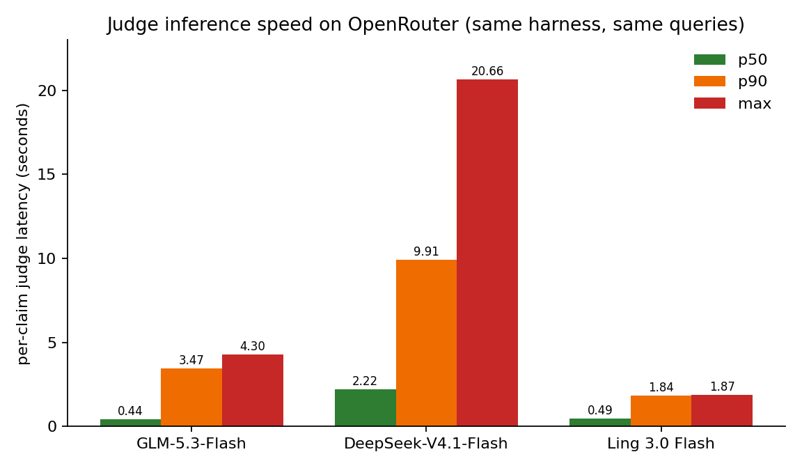

# Ragfaith

**Do you know when your agent is lying to you? This project does.**

RAG answers are only as reliable as the evidence behind them. In practice, models do more than simply repeat their sources. They paraphrase until the meaning changes, introduce details that are not in the retrieved passages, and sometimes make things up entirely.

We built an evaluation arena for faithfulness judges and compared a range of approaches: an NLI model, nine low cost LLM judges, several hybrid systems, translation based pipelines, a distilled student model, and two frontier models.

The evaluation uses 18,900 English claims from RAGTruth, 800 synthetic German and Italian cases, 600 organic real world answers, and two rounds of human adjudication.

The winning judge is not just a benchmark result. You can run it as a live guardrail on real conversations through three published integrations: the [ragfaith-proxy](https://pypi.org/project/ragfaith-proxy/) Python package, an OpenAI compatible sidecar for any client, the [@resonanceee/opencode-ragfaith](https://www.npmjs.com/package/@resonanceee/opencode-ragfaith) npm package, a plugin for opencode sessions, and the [ragfaith-mcp](https://pypi.org/project/ragfaith-mcp/) Python package, an MCP server exposing `check_faithfulness` to any MCP-capable host. All three are described in the [Integrations](#integrations) section below.

## The main result

**[glm-5.3-flash](https://openrouter.ai/z-ai/glm-5.3-flash) was the best judge we tested, including models that cost up to 22× more per token.** Its smaller counterpart, ling-3.0-flash, costs about a quarter as much while retaining roughly 97% of the response level quality.

| Judge | Claim F1 | Noise adjusted F1 | Cost, full 18.9k claims |
| --- | ---: | ---: | ---: |
| glm-5.3-flash | **0.481** | **0.693** | ~$1.92 |
| ling-3.0-flash | 0.457 · response F1 0.742 (98% of GLM) | — | $0.45 |
| NLI (mDeBERTa-xnli-2mil7) | 0.138 | 0.369 | free, local |
| Distilled MiniLM student | not promotable (2× negative result) | — | free, local |

## The evaluation setup

Each judge gets the same basic task.

Given a premise containing:

```text
QUESTION: …
PASSAGES: …
```

and one atomic claim taken from the model's answer, the judge decides whether the claim is:

* **faithful**
* **unfaithful**
* **unverifiable**

We tested four approaches:

* **A: NLI judge.** A 279M parameter DeBERTa model scores each passage and claim pair. It runs locally and costs nothing at inference time.
* **B: LLM judge.** An LLM is given the claim and premise and returns a strict JSON verdict.
* **C: Hybrid.** NLI handles cases where it is confident, with the LLM handling the remaining cases.
* **D: No decomposition.** The entire answer is judged in one pass. This serves as the control.

Two parts of the pipeline turned out to matter a lot.

First, breaking answers into atomic claims is important. Without it, response level F1 falls to 0.107.

Second, including the question in the premise improves LLM judge recall by 5.7 points.

## What we found

### NLI alone is not reliable enough

The NLI judge had only 0.23 recall. In other words, it missed roughly three hallucinations for every one it caught.

It was also poorly calibrated in the region where confidence matters most, with an ECE of 0.113.


### The hybrid does not save much

The hybrid approach looked promising at first, but the cost savings were smaller than expected.

To retain about 97% of the LLM judge's quality, we still had to send 93% of claims to the LLM. At the 0.85 threshold used in the shipped version, the hybrid lost about half of the LLM judge's F1.


### A small, focused LLM judge worked best

The best overall result came from the relatively inexpensive LLM judge.

It reached 0.475 claim F1 and 0.75 response F1, compared with 0.143 claim F1 for the NLI judge. The result was also reasonably stable across reruns, with 91% agreement.

Across the nine model sweep, we did not find another judge that offered a better quality to cost tradeoff.


### Larger frontier models did not improve the result

We also tested claude-sonnet-5 and deepseek-v4-pro on the same 1,000 claims.

The flagship model scored about 8 points below the flash model while costing roughly 22× as much. Another contender failed the strict JSON format on 13% of calls, resulting in a 42% retry cost.

That turned out to be a useful reminder that structured output compliance is part of the capability we actually need from a judge.

### Translation helped with German

For German, translating the claim and evidence into English before judging improved hallucination recall from 0.39 to 0.73.

Italian showed a smaller but still measurable improvement.

An early bug in the German evaluation data inflated the scores by about 20%. The results below use version 2 of the dataset, which is the only version we consider valid for comparison.


### Some of the apparent judge errors were annotation errors

We manually adjudicated 71 disagreements between the judges and the original labels.

In 42% of those cases, the original gold label was itself incorrect or ambiguous.

The most common judge error was therefore not missing a hallucination, but incorrectly flagging a faithful claim.

On the organic datasets, outright fabrications are also relatively uncommon, at less than 1%. Unverifiable drift is much more common, at roughly 8 to 10%.

That distinction matters. A model does not usually invent an entirely new fact. More often, it starts from something supported by the source and gradually moves beyond what the source actually says.


### Distillation did not work

We tried distilling the judge into a model 2.4× smaller.

It failed twice.

The student had to escalate 78% of claims to the larger judge in order to catch 95% of hallucinations. We kept the experiment because the negative result is useful: at least with this setup, reducing the judge to a smaller local model did not give us a useful accuracy and cost tradeoff.

## The numbers

### Experiment 1

Claim level results using the `neutral_neg` mapping.

| Arm | Judge | Precision | Recall | F1 | Response F1 |
| --- | --- | ---: | ---: | ---: | ---: |
| A | multilingual NLI | 0.104 | 0.229 | 0.143 | 0.446 |
| B | LLM (glm-5.3-flash) | 0.377 | 0.641 | **0.475** | **0.753** |
| C | hybrid @0.85 | 0.210 | 0.354 | 0.263 | 0.572 |
| D | no decomposition | — | — | — | 0.107 |

### Experiment 2

Cross lingual claim level results using the `neutral_pos` mapping.

| Arm | Judge | DE F1 | IT F1 |
| --- | --- | ---: | ---: |
| A | multilingual NLI direct | 0.556 | 0.774 |
| C | translate → English judge | **0.726** | **0.786** |
| D | hybrid NLI + LLM arbitration | 0.678 | **0.862** |

### Frontier model comparison

Each model was evaluated on the same 1,000 claims in a single pass.

| Model | Claim F1 | F1 (natural rate) | Recall | Cost per 1k |
| --- | ---: | ---: | ---: | ---: |
| glm-5.3-flash | 0.739 | **0.485** | 0.692 | ~$0.12 |
| ling-3.0-flash | 0.658 | 0.444 | 0.565 | ~$0.04 |
| claude-sonnet-5 | 0.702 | 0.403 | 0.686 | $2.64 |
| deepseek-v4-pro | 0.677 | 0.417 | 0.619 | $1.63 |

### Noise adjusted results

These use the adjudicated labels from `rfe noise-adjust`.

| Arm | Reported | Corrected |
| --- | ---: | ---: |
| exp4 B (GLM) | 0.475 | **0.693** |
| exp4 A (NLI) | 0.138 | 0.369 |
| exp2 C · DE | 0.726 | 0.931 |
| exp2 C · IT | 0.786 | 0.831 |

## How to interpret these results

There are a few important caveats.

* The headline numbers depend on prevalence and mapping conventions. We report both rather than hiding the difference.
* The noise correction is based on relatively small manually annotated cells. Treat it as directional evidence rather than a precise estimate.
* Labels in the organic set are self judged. The human review was not comprehensive.
* Costs are based on actual OpenRouter bills from September 2026 and came to about $19.40 in total.

## Reproducing the results

All reported numbers can be reproduced from the checked in caches without spending anything on API calls.

```sh
rfe repro
rfe threshold-sweep
rfe noise-adjust
rfe exp5 --repeat 2
```

`rfe repro` also checks for zero drift between the cached results and the expected outputs.

The full reproduction guide is in [docs/reproduce.md](docs/reproduce.md).

## Judge inference speed in live use

Benchmarks say which judge is accurate; they do not say whether it keeps up in a real conversation. We ran the proxy against fabricated sessions with 11–19 claims per reply and measured per claim judge latency on OpenRouter, with all three judge models behind the same harness and the same queries.

| Judge (OpenRouter) | p50 | p90 | max | Judge wall per reply | Parse errors | List price in/out per M tok |
| --- | ---: | ---: | ---: | ---: | ---: | --- |
| glm-5.3-flash | 0.44 s | 3.47 s | 4.30 s | 8.0–9.9 s | 13.3% | $0.075 / $0.25 |
| deepseek-v4.1-flash | 2.22 s | 9.91 s | 20.66 s | 30.7–43.8 s | 18.2% | $0.15 / $0.60 |
| ling-3.0-flash | 0.49 s | 1.84 s | 1.87 s | **4.5–6.5 s** | 26.3% | $0.021 / $0.063 |

Two findings stood out.

First, GLM keeps the best reliability to latency balance. DeepSeek is about 5× slower at p50 with a 20 second worst case and roughly twice the price, so there is no case for it as the judge here. Ling is the fastest per reply (about 2× GLM) and about 3× cheaper, but a 26.3% parse error rate means over a quarter of its calls burn a retry and parse failures fall back to `unverifiable`, which produces false flags under strict mode.

Second, concurrency is not a bottleneck on OpenRouter. A probe with `RFE_JUDGE_WORKERS=16` judged all 19 claims of a reply in 15.8 s with flat per call latency and zero 429s.



*Synthetic provider footnote: the same GLM judge served through synthetic measured p50 1.95 s, p90 10.86 s, and a 65.8 s worst case per call. That gap is not the model — synthetic caps concurrent sessions (live `HTTP 429 "Too many concurrent requests"` on the chat path, plus dropped streams under load), so judge calls queue server side. OpenRouter showed no such cap at 16 concurrent judge calls. All headline times above are therefore OpenRouter to OpenRouter.*

## Integrations

The evaluation eventually turned into live faithfulness guards for real conversations: a universal OpenAI-compatible proxy, an opencode plugin, and the `ragfaith-mcp` MCP server exposing `check_faithfulness` to any MCP-capable host.

All integrations use the same basic rules:

* The active model never judges its own output. By default the judge is GLM-5.3-Flash, with DeepSeek-V4.1-Flash used when GLM itself is active.
* Temperature is set to 0.
* Verdicts are cached by SHA256.
* Costs are logged using tokens only.
* Faithful replies produce no visible output.
* Flagged replies get one aggregated nudge.
* The system never automatically rewrites the model's answer.

### Universal proxy

An OpenAI compatible sidecar for clients that do not have a plugin system. FlowDown is the reference integration.

The proxy supports SSE stream through and extracts premises from tool result messages. It supports three nudge modes: `chain` (default, the correction streams right after the flagged reply), `next` (the nudge rides in with your next message), and `regen` (the client only ever sees the final, clean response at the cost of a longer wait).

The proxy does not store an API key. It forwards the client's `Authorization` header upstream and reuses it for judge calls.

Install:

```sh
pip install ragfaith-proxy         # from PyPI
ragfaith-proxy                     # http://127.0.0.1:8787
```

Then point any OpenAI compatible client at:

```text
http://127.0.0.1:8787/v1
```

and provide your provider key as usual.

Published on [PyPI](https://pypi.org/project/ragfaith-proxy/).

Setup guide: [integrations/proxy/QUICKSTART.md](integrations/proxy/QUICKSTART.md)

### opencode plugin

A faithfulness cascade for [opencode](https://opencode.ai) sessions, along with a deterministic document pull check.

The document check produces an advisory toast when a dependency is used without its documentation being fetched.

Premises are captured from content tools. Judging happens asynchronously, so it does not block the response.

Install:

```sh
npm install @resonanceee/opencode-ragfaith
```

```jsonc
// ~/.config/opencode/opencode.json
{ "plugin": ["@resonanceee/opencode-ragfaith"] }
```

You can also copy `integrations/opencode/src/index.ts` to `~/.config/opencode/plugins/ragfaith.ts`.

The judge needs its own key: `SYNTHETIC_API_KEY`, or `RFE_JUDGE_PROVIDER=openrouter` plus `OPENROUTER_API_KEY`. GLM-5.3-Flash stays the accuracy-first default judge; for a faster/cheaper option, set the primary judge to Ling 3.0 Flash (`RFE_JUDGE_MAIN_MODEL=inclusionai/ling-3.0-flash` on OpenRouter) — caveat: highest parse-error rate in benchmarks, so expect more `unverifiable` fallbacks until it clears the smoke gate.

Published on [npmjs](https://www.npmjs.com/package/@resonanceee/opencode-ragfaith) and [GitHub Packages](https://github.com/resonanceee/ragfaith/pkgs/npm/opencode-ragfaith).

Setup guide: [integrations/opencode/QUICKSTART.md](integrations/opencode/QUICKSTART.md)

### MCP server

For MCP-capable hosts, `ragfaith-mcp` exposes `check_faithfulness(question, passages, answer)` (per-claim verdicts with the same judge) and `judge_status()` over stdio.

```sh
pip install ragfaith-mcp
```

**The model must be instructed to call it** — via the system prompt for all sessions, or the first message for one session. Suggested wording and host configuration: [docs/mcp.md](docs/mcp.md).

## Development

```sh
pip install -e '.[dev,models]'
pytest
ruff check .
```

API judge calls require `OPENROUTER_API_KEY` in `.env`. Never commit the key.

Annotation tooling and instructions are in [docs/annotation_instructions.md](docs/annotation_instructions.md).

## Data sources and licenses

| Lang | Source | License |
| --- | --- | --- |
| EN | RAGTruth processed (wandb) | research use |
| DE/IT synthetic | SNLI / XNLI / 2mil7 `it_mnli` | CC BY-SA 4.0 / OANC / CC BY-NC 4.0 |
| DE organic | google/xquad `xquad.de` | CC BY-SA 4.0 |
| IT organic | crux82/squad-it test | CC BY-SA 4.0 |

### Italian data caveat

`it_mnli` is machine translated MNLI. It comes from the same general data family used to train the NLI judge, so the Italian synthetic results have a potential contamination issue.

For that reason, the Italian synthetic results should not be treated as an independent measure of NLI performance.
